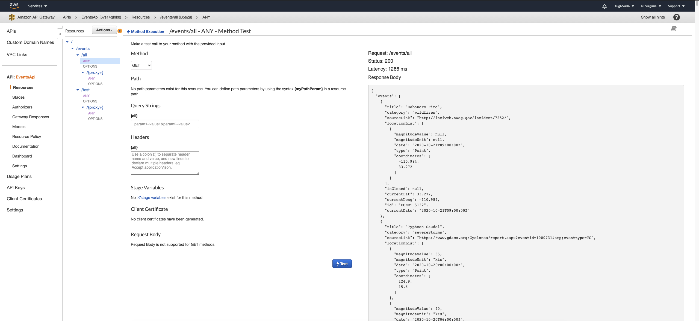

# GeoTracker
Repo containing the front-end for GeoTracker and the back-end configuration (amplify folder)

---

### Table of Contents

- [Description](#description)
- [How To Use](#how-to-use)
- [Roadmap](#roadmap)
- [References](#references)
- [License](#license)
- [Author Info](#author-info)

---

## Description

GeoTracker uses react native maps to display environmental events that are updated in real time. Through using the application, the user can interactively see current events and historical events such as weather, natural disasters, and other significant events. Users are be able to monitor specific events that directly affect them while also seeing what is affecting the rest of the world.  The user can also see trending tweets in the region of the map they are looking at, as well as tweets about specific disasters.

### Built With

- [React Native](https://reactnative.dev/)
- [Node.js](https://nodejs.org/en/)
- [AWS Amplify](https://aws.amazon.com/amplify/)
- [AWS Lambda](https://aws.amazon.com/lambda/)
- [Amazon Cognito](https://aws.amazon.com/cognito/)
- [Amazon DynamoDB](https://aws.amazon.com/dynamodb/)

[Back To The Top](#read-me-template)

---

## How To Use

### Installation for Andriod OS
Download the apk from this link  
[GeoTracker APK](https://exp-shell-app-assets.s3.us-west-1.amazonaws.com/android/%40geotracker/GeoTracker-70a78826d899437b894db8d9011807de-signed.apk)

or

Download Expo for Andriod.
- Go to Profile tab upon the loading of Expo Client.
- Sign in with User: geotracker | Password: GeoTracker
- Under Published Projects choose GeoTracker.

or

For users testing the release, download the apk given with release.

### Installation for iOS
Download Expo Client for iOS.
- Go to Profile tab upon the loading of Expo Client.
- Sign in with User: geotracker | Password: GeoTracker
- Under Published Projects choose GeoTracker.

[Back To The Top](#read-me-template)

---

## Roadmap
### Features
Demo 1 feature release
- UI Implementation
- Map Intergration
- Sign In/Out Integration

Demo 2 feature release
- Event Overlay
- Weather Overlay
- Save Event Option
- Share Event Feature

Demo 3 feature release
- Disaster Animation
- Weather Animation
- Twitter Trending Integration
- Weather Legend Overlay

### Known Bugs
- While on the feedscreen, when clicking a go button on an event's card, the functionality of the button doesn't work properly if the event it's navigating to is the last selected.
- On iOS, switching between tabs sometimes causes an undesired bouncing animation.
- On iOS, if your phone is in dark mode, you cannot see the text enter location inside the search bar.
- On iOS, upon loading of expo tunnel, the map shrinks and needs to be reloaded.
- When filtering for earthquakes, the occasional event pin will show a serve storm, but is an earthquake.
- Drop downs on filter screen should go away upon pressing outside of them.
- User should not be able to select a date in the future on the calenders. 
- App loading error crashed on load occasionally happens.
- Earthquakes don't show on animation play

--- 
## References

### Example API Request

[Back To The Top](#read-me-template)

---

## License

Copyright (c) [2020] [GeoTracker]

[Back To The Top](#read-me-template)

---

## Author Info

- Abraham Shultz - [@Agent215](https://github.com/Agent215)
- Tyler Howard - [@Tyler98ky](https://github.com/Tyler98ky)
- Alexander Photis [@aphotis22](https://github.com/aphotis22)
- Rob Burdash [@roburdash](https://github.com/roburdash)
- Juvenal Arellano-Santana [@juvenalll](https://github.com/juvenalll)
- Jianhua Chen [@jianhua3296](https://github.com/jianhua3296)

[Back To The Top](#read-me-template)

